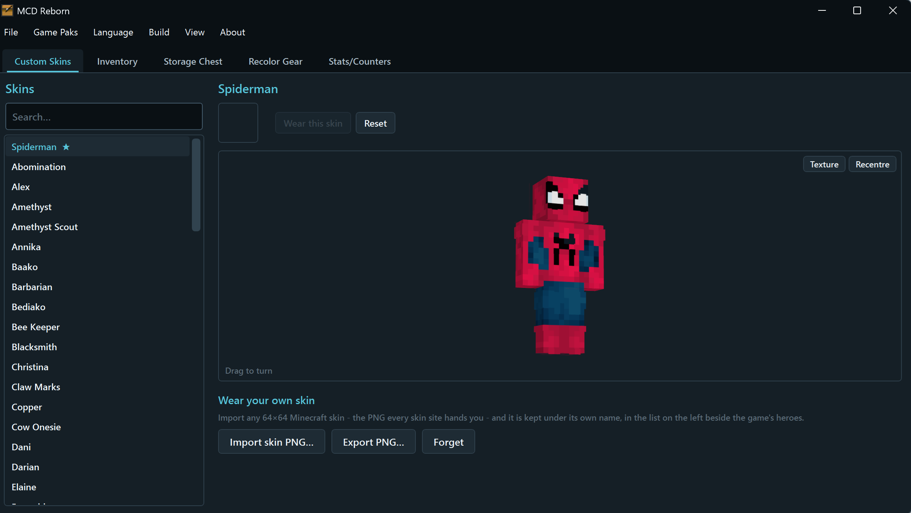
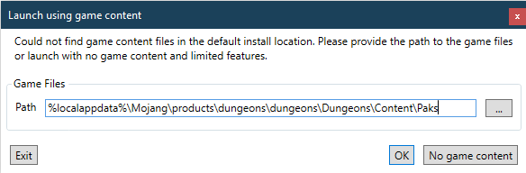
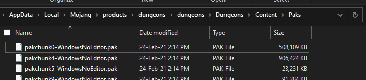

# &nbsp; MCD Reborn

 A companion app and modding platform for [Minecraft: Dungeons](https://www.minecraft.net/en-us/about-dungeons/) edit your save, restyle your heroes and gear, and change the camera while you play.
 This is extended Reborn version of [MCDSaveEdit](https://github.com/CutFlame/MCDSaveEdit) by CutFlame.

https://github.com/user-attachments/assets/37a02d17-7f2b-4d0c-a0f2-47f183cfc7b5

### Features

* **Everything MCDSaveEdit already did**: editing items, enchantments, stats, counters and currencies; reading and writing the encrypted save format
* Ported from .NET Framework 4.8 to **.NET 10**, every package updated, the known advisories cleared
* **Custom Skins tab**: play as any of the game's 67 hero skins, written to the save for you, no mod needed
* Wear any 64×64 Minecraft skin as your hero; import any skin from your favorite skin website
* A **Show armours** switch on both the Custom Skins and Recolor Gear tabs: wearing a skin hides armour so the skin can be seen, and one tick puts it all back
* Five themes in the **View** menu (Dark, Light, Nether, End and Frost), swapped live and remembered between runs
* Item search across the whole inventory, filtering as you type, without covering the UI
* A search box on every picker (items, armor, melee, ranged, artifacts, armor properties and enchantments), narrowing within whatever the filters already allow
* A **Defaults** button fills in the properties an armor drops with in game; changing an armor's type no longer replaces them by itself
* Right-click an inventory item to equip it; artifacts offer all three hotbar slots
* Right-click an equipment slot to unequip
* Every save backs the file up first, keeping one timestamped `.bak` beside it
* The enchantment picker opens on the gear type being enchanted, with **Melee / Armor / Ranged / Other** toggles
* A loading screen that is a themed card with a vector mark, version and status line
* **The Tower** tab: tower runs that you have started and saved will show here, allow modifying gear and floor progress
* 36 new enchantments the game carries but never offers, under the **Other** toggle
* Bulk Delete items on the inventory and storage chest tabs
* **Difficulty Tab:** Change how hard the game is while it is running. How tough, how fast and how heavy the enemies are, and your own speed, roll cooldown, roll charges, gravity and attack speed
* **Escalation**: enemies get worse the longer you stay in a level - by default a stage a minute, adding 1 to toughness and 0.2 to speed, stopping at ten times tough and three times fast. All five numbers are sliders: how long a stage lasts, what each one adds, and where each stops - wind the caps up and you get the version where the level eventually wins. A slim bar over the game says which of the nine stages you are in, how long until the next one, and what the multipliers are now. The clock restarts when you load a new level, not when you die. The overlay needs the game in borderless rather than exclusive fullscreen, which is how it runs by default
* **Press J to throw every enemy in the level into the air**, with the enemy gravity slider deciding how long they stay there - at normal weight they reach 141 units, at a fortieth nearly 3000. The two go together: gravity does nothing to a mob standing on the floor
* **Installed Mods Tab:** Every mod pak in one place. You can import and export multiple mods via a zip package.

#### Camera Feature
* **Change the camera while the game is running** - distance, angle, field of view, where it looks, shoulder offset and swing smoothing, all applied as you drag the slider. No mod pak, nothing written to disk, and quitting the game puts everything back
* **Third person and first person**, in a game that has neither: mouse look turns the view, W A S D move you, and clicking attacks instead of walking you there
* **Presets** - third person, third person far, first person, first person shooter - and you can save your own under a name and bring it back in one click
- **Ride**, can summon and ride the nearest creature, your summons, even your custom mounts via imported texture
- **Jump**, you can activate jump buy pressing the Q key when enabled which allows improved movement. 
- **Fly**, the default hotkey is G: makes character lift out of the level entirely, and switching it off drops them back to the floor. Space climbs and C drops, and forward follows wherever the camera points
* F10 turns the camera setup on and off from inside the game

#### Custom Builds Feature
* **Open in MCD Builder**: send the equipped loadout straight to [mcdbuilder.vercel.app](https://mcdbuilder.vercel.app/)
* **Import Build** and **Import and Equip** from the clipboard, refused up front if the inventory has no room for it

https://github.com/user-attachments/assets/509496fd-7186-4422-a639-9d10272be407

#### Recolor Gear Feature
* **Recolor Gear**: put your own artwork on a piece of gear, installed as a mod pak beside the game's own; the originals are never modified and Remove undoes it completely
* Armor, melee, ranged, artifacts, **capes, pets, enchantment icons and the interface and HUD**, picked one category at a time
* The texture travels to [mcddesigner.vercel.app](https://mcddesigner.vercel.app/) and back. Find, upload and download again
* **Any size up to 1024 square**, including the 256×256 enchantment icons - the designer takes a file at whatever size it is, and the link carries it

https://github.com/user-attachments/assets/1109d845-6a2e-49da-992d-f185dd0f4d26

#### Weapon Import Feature
* **Import your own model** onto any weapon: export a `.glb` from Blender (File -> Export -> glTF Binary) and the weapon comes out wearing it, mesh and texture together, weapons installed as a mod pak beside the game's own so deleting it undoes everything
* **Or just reshape the game's own model**: resize from a tenth up to **8x**, move and rotate it - a claymore at half size, a dagger the length of a spear, or something absurd
* A live 3D preview **painted with the real texture**, which you can drag to turn and scroll to zoom, with the **original ghosted behind your model**. That outline is where the game already knows how to hold the weapon, so keeping the handle end of your model on the handle end of the outline is all there is to aligning it
* **And onto bows and crossbows** - all 58 of them. A bow is four meshes, the shapes it takes as the string is drawn, so only the first is listed and your model goes into all four when you apply. It stops bending as it is drawn, which is a small price for a bow that is a fish
* **And onto the things the game throws.** A dropdown at the top of the list switches between **Weapons** and **Projectiles**: the ordinary arrow every bow fires, the Torment and Harpoon arrows, the Gale Arrow, fireworks, pumpkin seeds, the TNT box, fireballs and more - twelve in all. Fire a sword, a fish, or a bolt of your own shape
* A projectile flies along its own length, so a model whose nose points elsewhere flies sideways - the turn sliders straighten it. The ordinary arrow is shared by every bow, so changing it changes them all
* **Make it glow.** A switch, a colour and a strength, turning up the emissive the material already carries - the same numbers that make the Torment arrow glow blue, which sits at 125. Laser bolts are a thin model and a bright colour. Nothing new is compiled: the shader doing the glow is already in the game, which is why this works at all. A material with no emissive value cannot be lit, and the status line says how many were

#### Mob Import Feature
* **Import your own model onto a creature**: export a `.glb` from Blender the same way, pick a sheep, a pig, a wolf or any of 122 other meshes, and the creature comes out wearing it. A skateboard, a mount, a truck - anything is possible as long as you have 3D design for it.
* **Summoned creatures come out right too.** An artifact summons a variant with its own custom skin, you can change skin to achieve custom looking summons. 

#### DISCLAIMER: Please keep backups of your save files! This app does not guarantee your save file to be playable after editing!

---

### Installing and Running

For full features and functionality you need Minecraft: Dungeons installed and preferably in the default install location.

1. Download the latest release from [the releases section](https://github.com/cag11/MCDReborn/releases). It is a single self-contained `MCDReborn.exe` with no prerequisites. A smaller framework-dependent build is also published; that one needs the [.NET 10 Desktop Runtime](https://dotnet.microsoft.com/download/dotnet/10.0).

### How to Use

1. Go to `File > Open` in the menu bar.
2. Open the folder `%HOMEPATH%\Saved Games\Mojang Studios\Dungeons`. *Be sure to backup this folder before editing your save files.*
3. You will see a folder with a 16-digit number (E.g. 2612325419657064). Open this folder, then open the "Characters" folder.
    1. NOTE: If multiple Mojang or Microsoft accounts were used in-game you might see more than one folder. 
4. Select one of the files ending in `.dat`. There will be one for each character.
5. Click `Open` and edit your save. When ready go to `File > Save` or `File > Save As...` to save your edits.

---

### Troubleshooting

##### Fix Missing Images

If you see this popup, that means it couldn't find the game content in the default location. You need to provide the path to these `.pak` files:

##### Default location of pak files

Minecraft Launcher:

`%localappdata%\Mojang\products\dungeons\dungeons\Dungeons\Content\Paks`

Steam:

`%programfiles(x86)%\Steam\steamapps\common\MinecraftDungeons\Dungeons\Content\Paks`

Microsoft Store:

`C:\XboxGames\Minecraft Dungeons\Content\Dungeons\Content\Paks`

If you're not sure which version you have, additional information may be found on [Dokustash - stash.dokucraft.co.uk](https://stash.dokucraft.co.uk/?help=modding-dungeons)

##### If it closes by itself

It keeps a log at `%LOCALAPPDATA%\MCDReborn\log.txt`, and anything that went wrong is in it with
the full stack. Ordinarily it writes a handful of lines a session. For the whole story of what you
were doing, use the `-debug` build, or put an empty file called `verbose.txt` beside the exe.

##### Application Stopped Working

If during launch you get a popup saying that the application has stopped working,
this means an internal error occurred and could mean various issues.

The releases are self-contained and need no runtime installed. If you are running a
framework-dependent build instead, it needs the .NET 10 Desktop Runtime:

- [.NET 10 Desktop Runtime](https://dotnet.microsoft.com/download/dotnet/10.0)

---

### Special Thanks

Thanks to the original author CutFlame for coming up with the idea and creating the original MCDSaveEdit application.

Thanks to Plushy for discussing ideas, giving guidance and testing the application.

### Legal Disclaimer

This project is not affiliated with Mojang Studios, Microsoft, XBox Game Studios, Double Eleven or the Minecraft brand.

"Minecraft" is a trademark of Mojang Synergies AB.

Other trademarks referenced herein are property of their respective owners.

### External Credits and Licenses

[MCDSaveEdit](https://github.com/CutFlame/MCDSaveEdit) © Michael Holt ([MIT](https://github.com/CutFlame/MCDSaveEdit/blob/master/LICENSE))

[DungeonTools](https://github.com/HellPie/DungeonTools) © Diego Russi ([AGPL 3.0](https://github.com/HellPie/DungeonTools/blob/master/LICENSE))

[FModel](https://github.com/iAmAsval/FModel) © Free Software Foundation, Inc. ([GPL 3.0](https://github.com/iAmAsval/FModel/blob/master/LICENSE))

[PakReader](https://github.com/WorkingRobot/PakReader) © Aleks Margarian ([MIT](https://github.com/WorkingRobot/PakReader/blob/master/LICENSE))

[Game-icons.net](https://game-icons.net/) © Lorc, Delapouite and contributors ([CC BY 3.0](http://creativecommons.org/licenses/by/3.0/))
